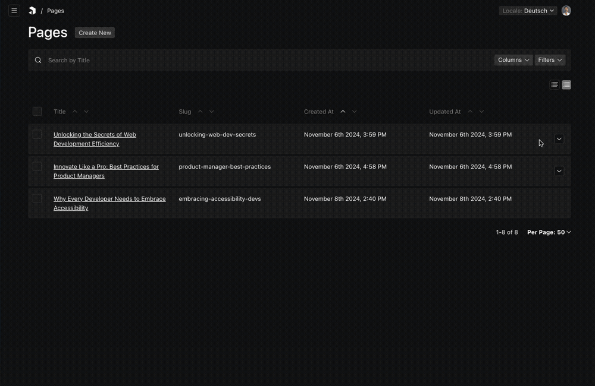

# Payload Tree List Plugin

**⚠️⚠️ WIP: not working since changes on beta.130, currently 3.X.X ⚠️⚠️**

A plugin for [Payload CMS](https://github.com/payloadcms/payload) that adds a collapsible Tree list view. This plugin depends on the [Payload Nested Docs Plugin](https://github.com/payloadcms/payload/tree/beta/packages/plugin-nested-docs) for its parent implementation.

This plugin is compatible only with Payload CMS version 3.x.



## Installation / How to use

**Minimum required payload version: 3.x**

Install the plugin using `yarn add @payloadcms/plugin-nested-docs payload-plugin-tree-list`. Then, add the plugin to your Payload configuration file:

payload.config.ts:

```ts
import { buildConfig } from "payload";
import { nestedDocsPlugin } from "@payloadcms/plugin-nested-docs";
import { treeListPlugin } from "payload-plugin-tree-list";


export default buildConfig({
  ...
  plugins: [
    nestedDocsPlugin({ collections: ["posts"] }),
    treeListPlugin({ collections: ["posts"] }),
  ],
  ...
});

```

## Testing locally

This project use `pnpm` workspaces.
Install all dependencies from root and build the plugin

```sh
pnpm i
pnpm build
```


To start the postgres database and the development server, run the following commands:

```sh
cd dev
cp .env.example .env
sh scripts/database-init.sh
pnpm dev
```

Access http://localhost:3000/admin

The plugin is configured for `pages` collection


